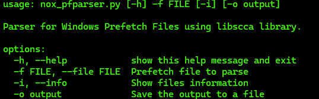

# Pf-Parser
This is a tool to parser Prefetch Files using Python. 

Windows Versions Tested:
- Windows 11
- Windows 10
- Windows 8.1
- Windows 7
- Windows Vista
- Windows 2003
- Windows XP
---
# Description

The idea of ​​the tool is to convert a Prefetch File from different versions of Windows to a readable stdout, on different shells (tested in Windows PowerShell and Debian Bash) using Python, allowing quick visualization of information without worrying about opening the file. The tool helps in forensics scenarios.

Lab inspiration that i used to make the tool: https://app.hackthebox.com/sherlocks/Campfire-1

---
# Usage and Options

First, do you need "libscca" library, you can install in requeriments.txt file using "pip install -r requirements.txt". But you can also use the command "pip install libscca-python". Others libs are native.

This is the menu help:

Simple Usage Example: python3 nox_pfparser.py -f FILE.pf

---
# Credits

I want to demonstrate my respect to other peoples that dedicated their time to write informations about prefetch files and also make other tools. I'm tried maked a multifunctional version of Eric Zimmerman Tool using python.

This is the links about references:
- Bromiley Article - https://bromiley.medium.com/parse-windows-10-prefetch-files-in-linux-51a764cc045a
- Bromiley Tool - https://github.com/bromiley/tools/tree/master/win10_prefetch
- Eric Zimmerman Tool - https://github.com/EricZimmerman/PECmd/
- Libscca library - https://github.com/libyal/libscca
- Windows-Prefetch-Parser Tool - https://github.com/PoorBillionaire/Windows-Prefetch-Parser
---